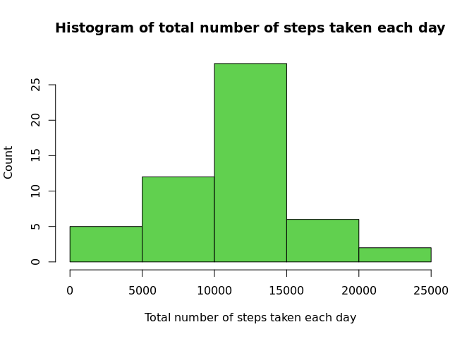
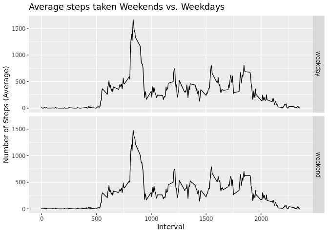

## Loading and preprocessing the data

``` r
# Some libraries to run all the code
library(dplyr)
```

    ## 
    ## Attaching package: 'dplyr'

    ## The following objects are masked from 'package:stats':
    ## 
    ##     filter, lag

    ## The following objects are masked from 'package:base':
    ## 
    ##     intersect, setdiff, setequal, union

``` r
library(ggplot2)
```

``` r
# Reading the data from the 'activity.csv' file.
activity <- na.omit(read.csv(file = 'activity.csv'))
activity$date <- as.Date(activity$date)
head(activity)
```

    ##     steps       date interval
    ## 289     0 2012-10-02        0
    ## 290     0 2012-10-02        5
    ## 291     0 2012-10-02       10
    ## 292     0 2012-10-02       15
    ## 293     0 2012-10-02       20
    ## 294     0 2012-10-02       25

## What is mean total number of steps taken per day?

**Objectives:**

1.  Make a histogram of the total number of steps taken each day
2.  Calculate and report the **mean** and **median** total number of
    steps taken per day

``` r
# Group 'activity' data by date
by_day <- group_by(activity, date)
# Summarise the sum of steps
steps_by_day <- summarise(by_day, total = sum(steps))

hist(steps_by_day$total, 
     xlab="Total number of steps taken each day", 
     ylab="Count", 
     main="Histogram of total number of steps taken each day",
     col=3)
```



``` r
mean_steps <- mean(steps_by_day$total)
median_steps <- median(steps_by_day$total)
```

The mean is 1.0766189^{4} and the median is 10765.

## What is the average daily activity pattern?

**Objectives:**

1.  Make a time series plot (i.e. `type = "l"`) of the 5-minute interval
    (x-axis) and the average number of steps taken, averaged across all
    days (y-axis)
2.  Which 5-minute interval, on average across all the days in the
    dataset, contains the maximum number of steps?

``` r
# Group data by 5 minute interval
activity_interval <- group_by(activity, interval)
# Summarize the average number of steps in that interval
five_average_by_day <- summarise(activity_interval, total = sum(steps)) 

# Make an average activity plot
plot(five_average_by_day$interval, five_average_by_day$total, 
     type="l",
     xlab="Interval",
     ylab="Average steps taken",
     main="Average steps taken during 5 minute interval")
```


``` r
max_step_interval <- five_average_by_day$interval[which.max(five_average_by_day$total)]
```

The highest step count happened at interval 835.

## Imputing missing values

**Objectives:**

1.  Calculate and report the total number of missing values in the
    dataset (i.e. the total number of rows with `NA`s)
2.  Devise a strategy for filling in all of the missing values in the
    dataset. The strategy does not need to be sophisticated. For
    example, you could use the mean/median for that day, or the mean for
    that 5-minute interval, etc.
3.  Create a new dataset that is equal to the original dataset but with
    the missing data filled in.
4.  Make a histogram of the total number of steps taken each day and
    Calculate and report the **mean** and **median** total number of
    steps taken per day. Do these values differ from the estimates from
    the first part of the assignment? What is the impact of imputing
    missing data on the estimates of the total daily number of steps?

``` r
# Sum the number of missing values
missing <- sum(is.na(read.csv(file = 'activity.csv')$steps))
```

There are 2304 NA values in the raw data set.

To fill in the NAs, we will take the average number of steps during that
5 minute interval over all days and assign it to that particular NA.

``` r
# Create a filled in data set by assigning the average value 
# for that time interval if an NA is found.
fill_data <- read.csv(file = 'activity.csv')
for (i in 1:nrow(fill_data)) {
    if (is.na(fill_data$steps[i])) {
        # Find the index value for when the interval matches the average
        ndx <- which(fill_data$interval[i] == five_average_by_day$interval)
        # Assign the value to replace the NA
        fill_data$steps[i] <- five_average_by_day[ndx,]$total
    }
}

# Make sure the date variable is still a date.
fill_data$date <- as.Date(fill_data$date)
```

Plot the new filled data set with a histogram:

``` r
# Group data by date, and summarise the sum of steps
fill_steps_per_day <- fill_data %>% 
    group_by(date) %>% 
    summarise(total=sum(steps))

# Show histogram of steps per day
hist(fill_steps_per_day$total, 
     xlab="Total number of steps taken each day", 
     ylab="Count", 
     main="Histogram of total number of steps taken each day",
     col=3)
```


``` r
fill_mean_steps <- mean(fill_steps_per_day$total)
fill_median_steps <- median(fill_steps_per_day$total)
```

The mean total number of steps per day is 8.4188066^{4} and the median
is 11458.

## Are there differences in activity patterns between weekdays and weekends?

**Objectives:**

1.  Create a new factor variable in the dataset with two levels –
    “weekday” and “weekend” indicating whether a given date is a weekday
    or weekend day.
2.  Make a panel plot containing a time series plot (i.e. `type = "l"`)
    of the 5-minute interval (x-axis) and the average number of steps
    taken, averaged across all weekday days or weekend days (y-axis).
    The plot should look something like the following, which was created
    using **simulated data**:

``` r
# Make weekday variable
fill_data$day <- weekdays(fill_data$date)
# Define all days as weekdays
fill_data$day_type <- "weekday"
# Fix days that are Saturday or Sunday to be weekends
fill_data$day_type[fill_data$day %in% c("Saturday", "Sunday")] <- "weekend"
```

Calculate the average weekday steps versus average weekend steps

``` r
# Group data by 5 minute interval and summarize the average
# number of steps in that interval
day_average <- fill_data %>%
    group_by(day_type, interval) %>%
    summarise(total=mean(steps))
```

    ## `summarise()` has grouped output by 'day_type'. You can override using the
    ## `.groups` argument.

``` r
qplot(interval, total, data=day_average,
      type="l",
      geom="line",
      xlab="Interval",
      ylab="Number of Steps (Average)",
      main="Average steps taken Weekends vs. Weekdays",
      facets=day_type ~ .)
```

    ## Warning: `qplot()` was deprecated in ggplot2 3.4.0.

    ## Warning in geom_line(type = "l"): Ignoring unknown parameters: `type`


